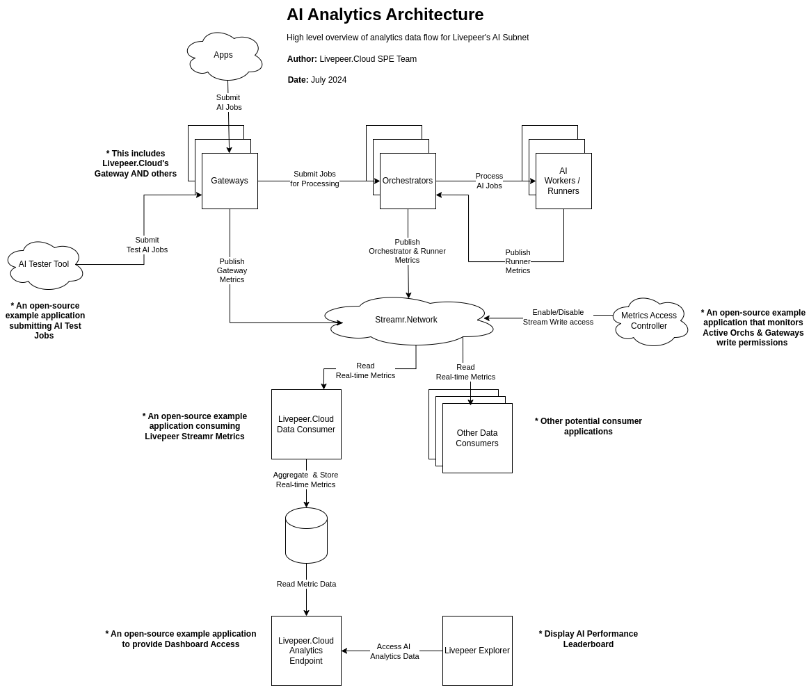

# Overview
[Livepeer Naap Overview](https://www.notion.so/livepeer/Livepeer-Network-as-a-Product-2a30a348568780919946f80211e326ab)

[Livepeer NaaP MVP](https://www.notion.so/livepeer/Network-as-a-Product-MVP-SLA-Metrics-Analytics-Infra-2a70a3485687802ebbdad8a1a501827a)

# Architecture


* Event Schema?
* Data Validation?

# Metrics To Collect

[Livepeer NaaP Metrics Catalog](https://www.notion.so/livepeer/6914345d128b477d81ee48409a6a9c90?v=fcb9e18cfe2c4746860c58b16a48c8b2)

## High
* CUDA Utilization Efficiency (CUE)
* E2E Stream Latency
* Prompt-To-First-Frame Latency

## Medium 
* Bandwidth(upload/download)
* Jitter Coefficent
* Failure Rate
* Swap Rate

## Low
* Startup Time
* Output FPS


## Future Metrics Collection
Ideas: metrics that fulfills their narrative - "realtime, scalable, leading edge, decentralized AI video is available on livepeer, which is growing in fees by the day"

* Price related????
    * how much is one getting paid per hour given a certain model, gpu, and mean 'latency score' binned by certain views like stake.
* how many jobs were running in the network
* Operating System Metrics 
    - CPU Type / Usage
    - RAM Type/Amount/Usage
    - Disk Amount/Usage
    - GPU Type/VRAM/Usage
* what else?????

# Streamr.Network Integration
[Streamr docs](https://docs.streamr.network/)

## Producer

## Consumer

## Historical Storage vs Realtime 
[Streamr Storage](https://docs.streamr.network/usage/streams/store-and-retrieve) 

[Storage Registry Smart Contract Polygon](https://polygonscan.com/address/0x080F34fec2bc33928999Ea9e39ADc798bEF3E0d6#readProxyContract)


* Cloud will NOT use storage nodes (unless we can define a true Streamr "storage node"). Otherwise, CloudSPE will collect all stream data and store to parquet (or some other format) for historical archival

## Access Control
[Streamr Permissions](https://docs.streamr.network/usage/streams/permissions)

* Should Streamr Stream be owned by Livepeer Foundation????

https://docs.streamr.network/usage/streams/signature-verification/#smart-contract-pubsub-erc-1271

## Partitions
[Streamr Partitions](https://docs.streamr.network/usage/streams/partitioning)

* Streamr advises to partition when messages throughput > 100 messages/second
    * what partition keys?


# go-livepeer Integration

[Lisbon Portual Hackathon Changes](https://github.com/livepeer/go-livepeer/pull/3774)

## Metrics Collection

* Census.go??

* Open Pool "Event Tracker" - incision points

* AI Runner / Transcoder metrics need to funnel into the Orchestrator for publishing. Otherwise access control could be problematic.

* How will access control be granted? we cannot require the Orch ETH Key to be present. How to "delegate" the Orch's writes to another wallet?

## Local Streamr PUblisher
* How to ensure access control?
* 

## Prior Metrics Work
* [AI Stream Test](https://github.com/livepeer/go-livepeer/pull/3241) changes need to be merged
    * need to fix the "Network Capabilities" endpoint logic to use brad's logic

# Other Resources

[Evan's Unified Network Pipeline Notes](https://livepeer.notion.site/Livepeer-Hackathon-Unified-Network-Data-Pipeline-2860a348568780b987bed752e2220c63#2f1532348d304be2943e3a93e4650af9)


## SAMPLE PAYLOADS

### existing go-livepeer messages - including Open Pool

```json
[
  {
    "id": "b6efce36-6ee9-4a5d-b2f2-715efcd4b32d",
    "type": "node_trace",
    "timestamp": "2025-12-05T16:24:24.271818368Z",
    "payload": "gateway-reset"
  }
]
```

```json
[
  {
    "id": "b68ff76d-abd9-4046-b17a-5b300c8d6407",
    "type": "node_trace",
    "timestamp": "2025-12-05T16:24:26.646101802Z",
    "payload": "orchestrator-reset"
  }
]
```

```json
[
  {
    "id": "6993003f-f2ca-434c-bee7-950562a27e15",
    "type": "worker-connected",
    "timestamp": "2025-12-05T16:24:31.228265243Z",
    "payload": {
      "connection": "127.0.0.1:46800",
      "ethAddress": "0x5263E0Ce3a97B634D8828CE4337aD0F70B30B077"
    }
  }
]
```

```json
[
  {
    "id": "0224e0ba-0c91-4eda-933f-96b31bcf9e34",
    "type": "node_trace",
    "timestamp": "2025-12-05T16:24:31.226345484Z",
    "payload": "transcoder-reset"
  }
]
```

```json
[
  {
    "id": "fa3eb4ca-d9a7-41de-a552-69c427582381",
    "type": "discovery_results",
    "timestamp": "2025-12-05T16:24:36.844802833Z",
    "payload": [
      {
        "address": "0x52cf2968b3dc6016778742d3539449a6597d5954",
        "latency_ms": "93",
        "url": "https://localhost:18935"
      }
    ]
  }
]
```

```json

[
  {
    "id": "f6643ebc-3d34-4ed1-8eb9-595228d5264b",
    "type": "network_capabilities",
    "timestamp": "2025-12-05T16:24:46.259972687Z",
    "payload": [
      {
        "address": "0x5263E0Ce3a97B634D8828CE4337aD0F70B30B077",
        "local_address": "0x52CF2968b3DC6016778742D3539449a6597D5954",
        "orch_uri": "https://localhost:18935",
        "capabilities": {
          "bitstring": [
            94422687743
          ],
          "capacities": {
            "0": 2,
            "1": 2,
            "2": 2,
            "3": 2,
            "4": 2,
            "5": 2,
            "6": 2,
            "7": 2,
            "8": 2,
            "9": 2,
            "10": 2,
            "11": 2,
            "12": 2,
            "14": 2,
            "15": 1,
            "16": 1,
            "17": 1,
            "18": 1,
            "26": 2,
            "27": 1,
            "28": 1,
            "29": 1,
            "30": 1,
            "31": 1,
            "32": 1,
            "34": 1,
            "36": 1
          },
          "version": "0.8.3",
          "constraints": {
            "minVersion": "0.8.3"
          }
        },
        "capabilities_prices": null,
        "hardware": null
      }
    ]
  }
]
```

```json
[
  {
    "id": "e041c365-7339-47f5-95fc-a1616359b263",
    "type": "create_new_payment",
    "timestamp": "2025-12-05T16:24:49.259990375Z",
    "payload": {
      "capability": "",
      "clientIP": "",
      "faceValue": "3400000000000000 WEI",
      "manifestID": "mike-test",
      "numTickets": "1",
      "orchestrator": "https://localhost:18935",
      "price": "137.038 wei/pixel",
      "recipient": "0x5263E0Ce3a97B634D8828CE4337aD0F70B30B077",
      "requestID": "",
      "sender": "0x5aE4E42dB3671370a0c25AfF451E7482aAEc3D0B",
      "sessionID": "3198bee9",
      "winProb": "0.0000147059"
    }
  }
]

```

```json
[
  {
    "id": "9255b365-50b3-4620-b6ea-ff5a7f727506",
    "type": "job-processed",
    "timestamp": "2025-12-05T16:24:50.197195053Z",
    "payload": {
      "computeUnits": 41580000,
      "duration": 4167,
      "ethAddress": "0x5263E0Ce3a97B634D8828CE4337aD0F70B30B077",
      "fees": 5696460000,
      "pricePerComputeUnit": 137,
      "realTimeRatio": 4,
      "responseTime": 845
    }
  }
]

```

```json
[
  {
    "id": "8c513c53-98a5-4b48-9b78-d34b2fc41a6e",
    "type": "discovery_results",
    "timestamp": "2025-12-05T16:24:50.38026783Z",
    "payload": [
      {
        "address": "0x52cf2968b3dc6016778742d3539449a6597d5954",
        "latency_ms": "1",
        "url": "https://localhost:18935"
      }
    ]
  }
]

```

```json
[
  {
    "id": "d5d309d6-bf2c-45db-8e63-4781e4778f6a",
    "type": "worker-disconnected",
    "timestamp": "2025-12-05T16:28:26.112684001Z",
    "payload": {
      "connection": "127.0.0.1:46800",
      "ethAddress": "0x5263E0Ce3a97B634D8828CE4337aD0F70B30B077"
    }
  }
]
```

# OPEN ITEMS/Questions

## notes about go-livepeer integration

* (DONE) pool event tracker and hackathon event publisher need to be merged
* streamr support multiple protocols (mqtt,http,web socket, etc...) - do we enable all these in go-livepeer??
* when the stream node is offline, the Orch/GTateway/Trans/Worker should work without it... WHAT HAPPENS to event data????
* when the gateway and orchestrator shutdown (abruptly ) - NO shutdown message is logged to the STREAMR pipe
* need to include MORE data with each message to streamr 
* orchestrator and gateways messages are generic and cannot be differentiated from other orch/gateways/etc...
* streamer publisher needs to have accesscontrl that allows for ANY orch or gateway to publish to streamr streams.
    * the current impl requires a centralized publsher with streamr private key. 
    * need some sort of "registration" mechanisum that allows the orch private key to "delegate" an ETH wallet (private key) to allow publishing on their behalf.
    * streamr publisher needs ACL to enable orchs/ gateways that are "active" based on livepeer smart contracts

## METRICS COLLECTION QUESTIONS

See Comments in the 
https://www.notion.so/livepeer/Network-as-a-Product-MVP-SLA-Metrics-Analytics-Infra-2a70a3485687802ebbdad8a1a501827a